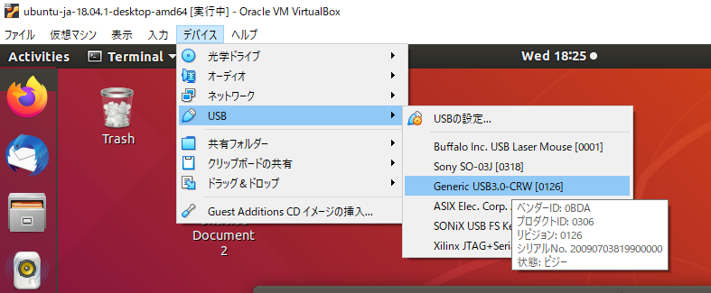

Ultra96V2ボードを買ったので、備忘録です。

使い方がアレなのでいろいろと偏った情報かもしれませんが。
後から思い出して書いているものや、調べるだけで試していないものもあります。
随時更新中です。

# ボードの情報
まずは回路図とか、BSPとか、ドキュメントとかゲットしましょう。

  - http://zedboard.org/product/ultra96-v2-development-board
  - https://www.element14.com/community/community/designcenter/zedboardcommunity/ultra96?ICID=zedboardCMTY-side-navigation&

# @ikwzm 氏の Debianイメージ
## イメージ本体
  - https://qiita.com/ikwzm/items/0c6f110aa19e368af03d
(現在は v2019.2版が公開されています https://qiita.com/ikwzm/items/92221c5ea6abbd5e991c)

VirtualBoxとかでSDカードのパーティーション切るときは安定しない場合はUSBカードリーダーを2.0ポートにさすと無難な模様です(遅いですが)。

パーティーションは先頭に4Mほど空領域を置くと、クラスタとFlashのブロックの境界がそろいパフォーマンスが出るはずです(未確認)。
※ SD Association 公式の [SDフォーマッタ](https://www.sdcard.org/jp/downloads/formatter/)使うと先頭に空きができるので事前にフォーマットしておいてそこからResizeする方がいいかもしれません。

VirtualBoxのUbuntuを使っていますが USBのSDカードリーダーを「デバイス」→「USB」で選ぶと、UbuntuからSDカードが見えるようになります。

私は Ubuntu から gparted を使ってGUIでパーティーション設定をしています。


UART (JTAGカードなど) もしくは、DisplayPort があれば、コンソール使えるようなので、後半の設定はUltra96上でやった方が楽かもしれません。
私は DisplayPortは [AMC-MDPHD](https://www.amazon.co.jp/gp/product/B06XG2PNJN/) を使っています。

## JTAG用の修正
  v2019.2版では最初から設定されているので不要です。

  v2019.1版では  uEnv.txt に cpuidle.off=1 を追加すると良いようです。以下情報元です。
  - http://nahitafu.cocolog-nifty.com/nahitafu/2018/10/ultrascalejtagl.html
  - https://qiita.com/ikwzm/items/e5e906309a5974615d40

## ユーザー作成
  adduser でユーザーを作ります。
  - https://qiita.com/strike_yanagi/items/06ef6751f949245f7adc

sudo権限もつけておきます
```
gpasswd -a username sudo
```

sudo するたびに「sudo: unable to resolve host」と出たので
https://qiita.com/ogomr/items/89e19829eb8cc08fcebb
にならって
```
sudo sh -c 'echo 127.0.1.1 $(hostname) >> /etc/hosts'
```
としています

## Samba設定
rootで入って

```
pdbedit -a username
nano /etc/samba/smb.conf
systemctl restart smbd nmbd
```

こんな感じだったと思います
smb.conf を
read only = no
にしておくと読み書きができるようになります

## ssh と X-Windowポート転送
TeraTermの「設定」->「SSHポート転送」で「リモートのXアプリケーションをXサーバーに表示する」をONにして、「設定」->「設定の保存」。TeraTerm再起動して、sshで接続します。
Windows側には[Xming](https://ja.osdn.net/projects/sfnet_xming/)などを入れておきましょう。

```
sudo apt update
sudo apt upgrade

sudo apt install -yV xauth
sudo apt install -yV x11-apps

nano /etc/ssh/sshd_config
sudo service sshd restart
```

sshd_config は X11Forwarding yes とすればよいはずです。当初 xauth を入れ忘れていて嵌りました。ご注意ください。

```
xclock &
xeyes &
```

として動作確認します。

（ちなみにforward設定前に直接接続を試しましたが、Windows側でXmingの X0.hosts に Ultra96 のIP を追加して、ファイアーウォール確認して(Xmingに権限つけるか、6000番を開ける)DISPLAYを定義すればX自体は動く模様です。
TeraTermではなくコマンドラインのsshで -v つけて確認しましたが、「X11 forwarding requested but DISPLAY not set」としか出てくれず悩んで、クライアント側の DISPLAY 設定したらエラーが 「Remote: No xauth program; cannot forward X11」に変わってxauthがいないのに気づいた次第です。GUI使っているといろいろ見落としますね。）

Zynqの場合各種の制御に sudo コマンドを付けてプログラムを実行することも多いと思います。

 .profile に

```
export XAUTHORITY=$HOME/.Xauthority
```
を追加しておけば sudo でも X が使えるようになるようです。

## fpgautil
 - https://xilinx-wiki.atlassian.net/wiki/spaces/A/pages/18841847/Solution+ZynqMP+PL+Programming
にある[fpgautil.c](https://xilinx-wiki.atlassian.net/wiki/download/attachments/18841847/fpgautil.c?version=2&modificationDate=1549947129137&cacheVersion=1&api=v2)を落としてきてビルドすればいいのだと思う(追記：[dtbocfg.rb](https://github.com/ikwzm/ZynqMP-FPGA-XRT-Example-1-Ultra96)を使う方法など便利な方法が他にもいろいろありそうです)。

## Python設定
やりかけですが
```
sudo pip3 install jupyter
sudo pip3 install matplotlib
```
などpipでいろいろインストール可能です。

## OpenCV
- https://github.com/atinfinity/lab/wiki/Linux%E7%92%B0%E5%A2%83%E3%81%A7%E3%81%AEOpenCV%E3%83%93%E3%83%AB%E3%83%89
を参考に挑戦中です。

ただし
```
-D WITH_EIGEN=OFF \
-D WITH_IPP=OFF \
-D WITH_OPENCL=OFF \
-D WITH_OPENGL=OFF \
-D WITH_TBB=OFF \
-D WITH_V4L=ON \
```
あたりを変更しました
WITH_V4L=ON
しないとUSBカメラが動きませんでした。他は余計なものまでOFFしているかもしれません。

build.sh を準備したうえで、下記のような感じです。
(libjasper-dev はパッケージが見つかりませんでした。)

```
sudo apt-get -yV install cmake libeigen3-dev
sudo apt-get -yV install libgtk-3-dev qt5-default freeglut3-dev libvtk6-qt-dev
sudo apt-get -yV install libtbb-dev
sudo apt-get -yV install libjpeg-dev libpng++-dev libtiff-dev libopenexr-dev libwebp-dev
# sudo apt-get -yV install libjasper-dev
sudo apt-get -yV install libhdf5-dev

sudo apt-get install -yV wget unzip

mkdir opencv
cd opencv
wget https://github.com/opencv/opencv/archive/3.4.9.zip
unzip 3.4.9.zip
cd opencv-3.4.9

# https://gist.github.com/atinfinity/0aea057af98dcf5a838da23becfdffbe
sh build.sh
cd build
make -j4
sudo make install
sudo ldconfig
```

OpenCVの imshow で Xに画像表示したら
「Error retrieving accessibility bus address: org.freedesktop.DBus.Error.ServiceUnknown: The name org.a11y.Bus was not provided by any .service files」というエラーが出たのですが

```
sudo apt install at-spi2-core
```

としたら直ると書いてあったのでやったら直りました。

OpenCV3 は 3.4.9が最新だったのでそれにしました。

## USBカメラ

```
 sudo apt install usbutils
```

C270を接続。 lsusb では、「Logitech, Inc. Webcam C270」と出てきた。

```
sudo apt install fswebcam
sudo fswebcam test.jpg
```

で、画像は test.jpg に取り込めました。

sudo を不要にするには

```
sudo usermod -a -G video username
sudo chmod a+rw /dev/video0
```

で行けそうです。

# bootgen
bootgenも入れておきます。
```
git clone https://github.com/Xilinx/bootgen
cd bootgen/
make
sudo cp bootgen /usr/local/bin/
```

# シャットダウン
シャットダウンする場合は
```
sudo shutdown -h now
```
もしくは
```
sudo poweroff
```
とすると 2019.2版から電源が落ちるようになっている模様です(素晴らしい)。
(haltコマンドだと電源切れない？)


# Petalinux(おまけ)
debianとは別にちょっと挑戦してみました。
Vivadoで回路作ってexportした後、たぶんこんな感じだと思うのですが、ディスク容量不足で通せていないです。
```
petalinux-create -t project -n ultra96v2 -s ultra96v2_oob_2018_3.bsp
cd ultra96v2
petalinux-config --get-hw-description=../ultra96v2.sdk
petalinux-build
petalinux-package --boot --force --fsbl images/linux/zynq_fsbl.elf \
--fpga images/linux/design_1_wrapper.bit --u-boot
```
また時間のある時に挑戦してみたいです。
