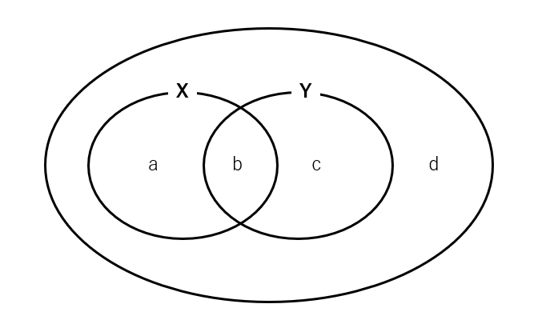

# ベイズ推定の式

ベイズ推定の式
$$ P(X|Y)= \frac{P(Y|X)P(X)}{P(Y)} $$
の私的覚え方。

# 集合論的な絵にしてしまう
下記のような絵(ベン図)をで考えてしまう。

ここで、全体(a+b+c+d)の中のある値がXに属する確率$ P(X) $は
$$ P(X) = \frac{a+b}{a+b+c+d} $$
であり、Yに属する確率 $ P(Y) $ は同様に
$$ P(Y) = \frac{b+c}{a+b+c+d} $$
と考える

そうすると、$ P(X|Y) $ は、Yが起こった後でのXのである確率なので分母の範囲をYの範疇にスコープして
$$  P(X|Y)= \frac{b}{b+c} $$
と考えることができる。

同様に
$$  P(Y|X)= \frac{b}{a+b} $$
と考えればよい。

そうすると、XとYが同時に起こる確率 $ P(X \cap Y) $ は、X→Yの順で判明した場合も、Y→Xの順で判明した場合とどちらの経路を通っても良く
$$ P(X \cap Y) = \frac{b}{a+b+c+d} = P(X) P(Y|X) = P(Y) P(X|Y) $$
であるから、冒頭の
$$ P(X|Y)= \frac{P(Y|X)P(X)}{P(Y)} $$
が導ける。

当初私はこういう形で理解していたのですが、こういうふうに絵で覚えておくと、数式を暗記するより覚えやすいし忘れにくいなと思ったので参考までにです。

結局のところ、状態の変化(事前条件)によって、今見えている部分(分母部分)が変わるだけで、全体像が変わるわけではないので「今見えている部分」が全体像のどの部分なのかを常に意識しておくと、今求めようとしているものを見失うことが無いのではないかと思います。
如何せん事後状態において見えている部分といのは事前にあった全体状態の部分集合に過ぎませんので、今見ている部分での事象から、全体で見たときの事象を予想するというのがベイズ推定の考え方なのかなと理解している次第です。
