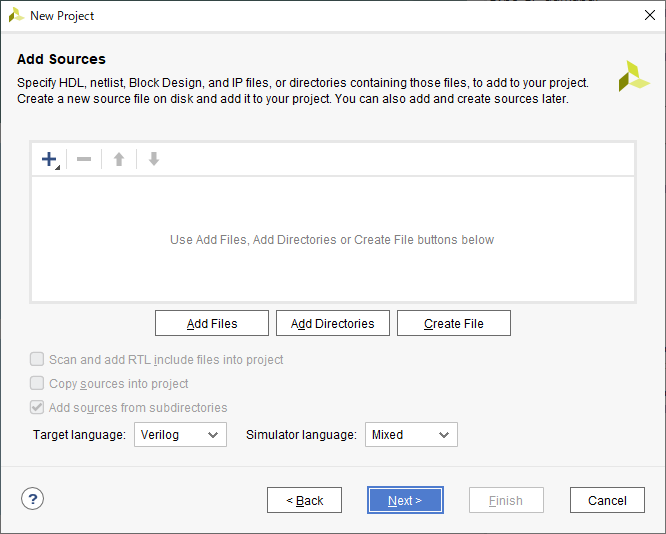
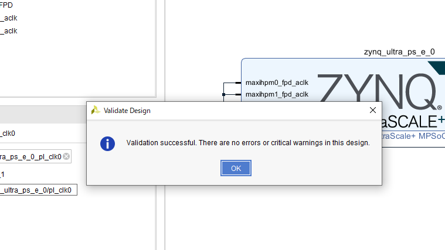
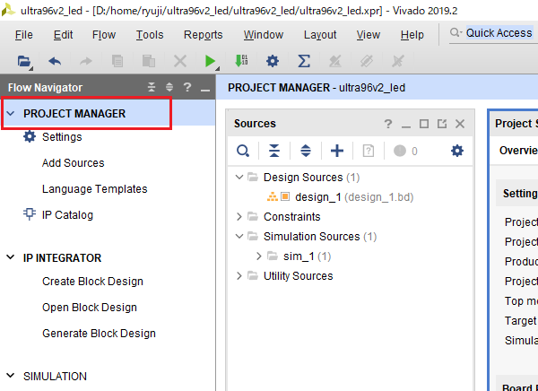
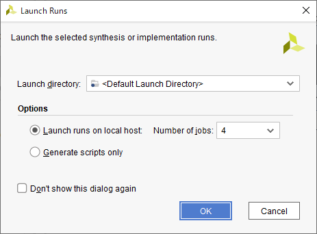
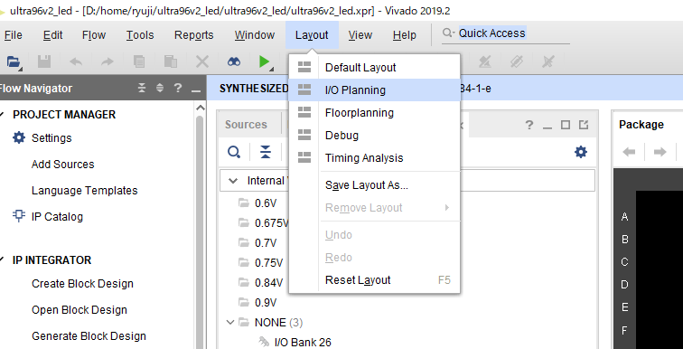

# はじめに
[Ultra96V2](https://www.avnet.com/wps/portal/japan/products/product-highlights/ultra96/) で PL から LED を光らせるいわゆるLチカを行っております。
たどり着くまでにいくつかやり事があるのですが、本記事はまずVivadoでPL用のbitstreamを作るところまでを書きました。

よくある PS からソフトウェアでLチカをするのではなく、PLに繋がっているRADIO_LEDでLチカを行うことを目標にしています。

「FPGAが使ってみたくて、RTL(VerilogやVHDLなど)を勉強しつつ勧められてUltra96を買ってみたけど、何をすればいいかわからない」といった人向けの内容を目指しています。まず Verilog で LEDをチカチカさせてみたいですよね。
実はこれZynqの場合、結構大変なんので、理解の一助になれば幸いに思います。

# 環境
今回は以下の環境で行っています。

- Vivado 2019.2
- Windows10搭載PC

なお、Zynq を本格的に開発する場合は Linux が必要となりますので、Windowsユーザーであっても、VirtualBoxなどを用いて Ubuntu などの Linux マシン上で環境構築することをお勧めしておきます。

# 事前準備

## Vivadoのインストール
  本稿では Vivado2019.2 を使います。しかしながら Vitis 2019.2 をインストールするとその際に一緒にVivado2019.2をインストールできますので、Zynq を扱う場合は Vitis ごとインストールすることをお勧めします。
　どちらも[Xilinxのページ](https://japan.xilinx.com/support/download.html)からダウンロード可能です。

## ボードファイルのインストール
Ultra96に搭載されている Zynq系 のLSIは、まずPS(プロセッサ)部分のソフトウェアが最初に起動する仕組みになっており、ボードに搭載されている LPDDR4(メモリ)など各種のデバイスに合わせてPS部が初期設定される必要があります。
これらの設定は、回路図やデバイスのデータシートを読みながら自力で設定しても良いのですが、大変ですのでボードメーカーの設定をそのまま使うのが楽です。
Zynq の PL(プログラマブルロジック)部分を扱う場合、PS部の設定を前提に設計する必要がありますので、あらかじめPSがどのように設定しているのかを合成ツール(Vivado)に教えてあげる必要があります。
ボードファイルには他にもいろいろな役割があるのですが、ひとまずインストールしておけば、これらの事を簡単に行うことが可能になります。

AVNET社のボードファイルは

[https://github.com/Avnet/bdf](https://github.com/Avnet/bdf)

にあります。gitでcloneしたり、zipファイルでダウンロードすることが可能です。
取得したイメージの ultra96v2 フォルダがボードファイルですので Vivado をインストールした先にコピーすればOKです。

インストール環境に応じて場所は変わりますが、例えば私の環境の場合は下記となりました。
C:\Xilinx\Vivado\2019.2\data\boards\board_files

# Vivado プロジェクトの作成
Vivadoを起動すると以下のような画面が出るかと思います。


Create Project を選んでプロジェクトを作りましょう。


NEXTを選びます


ここでは ultra96v2_led というプロジェクト名にしています。
パスは各自の好きな場所に設定してください。
ただしWindowsではパス名に260文字の制限があり、Vivadoが内部で非常に深いパスを作ることがあるので、なるべく短いパス名の場所に置くことをお勧めします。

引き続き、NEXTを押していくと





デバイス選択のダイアログが出ますので、Boardsのタブを選びます。


ボードファイルのインストールがうまくいっていればボード一覧の中に Ultra96v2 が現れますので選択します。
表示に時間のかかるケースもあるのでそういう場合は少し待ちましょう。Search欄にultra96と打ち込むと検索できます。


選択したら NEXT を押します。

最後のダイアログで Finish を押せばプロジェクトが出来上がります。


# Block Design
プロジェクトが完成したら、早速RTLを書きたいところですが、はやる気持ちを抑えて、まず最初に Block Design で PS部分の定義をしてしまいたいと思います。

左側にある Create Block Design を選択してください。


design_1 という名前のデザインを作ろうとしますが、今回はそのまま OK としました。


block design の画面になるので


Add IP ボタンを押してください


IPを選択する画面が出てくるので Search に zynq と打ち込んで、出てきた 「Zynq UltraScale+ MPSoC」を選択してください。


画面にZYNQ UltraSCALE+ と描かれたIPが現れます。このIPはPS部分を丸々含んだZynq特有のIPでプロジェクトの中で１個だけ生成して使います(LSIの中に物理的に1個しかないので)。
続けて「Run Block Automation」を押してください。


Run Block Automationダイアログが出ますので「Apply Board Preset」にチェックが付いていることを確認してOKを押してください。


これで、Ultra96V2のボードにあった設定がボードファイルを元にIPに設定されます。
なお、注意点として、ここで行う設定は「PS部のソフトウェアがこのように設定してくれる前提でPLはこのIP(PS部)を使いますよ」と宣言しているだけで、実際にはこれと一致する設定を別途PSのソフトウェアで行う必要があります(不整合にならないように管理するのはユーザー側の責任となります)。
PSの設定は、FSBL(First Stage Bootloader)で行ったり、Linux起動後にDeviceTree overlay などの機構で行ったり、JTAGデバッグ時にJTAGから行ったり、方法は様々ですがなんらかの方法で行う必要があります(これらの説明はまた機会があれば別の記事にて記載します)。
この設定はexport可能なので、PLの設計に合わせてPSのソフトウェアを作ることもできますし、その逆にPS側の設定を(最大公約数的なものに)決めておいて、それにあわせてPLを設計していくようなやり方も可能です。


さて、今回は、**PS側のソフトウェア設定がボードファイルのデフォルト値でなされていることを前提に**話を進めます。
ここで一度 PSの設定を覗いておきましょう。ZYNQ UltraSCALE+ と描かれたIPをダブルクリックしてみてください。
次のようなダイアログが開いたと思います。


この膨大な機能を持ったIPはPS部全体を含んだものです。この部分のみでLinuxを起動させて一般的なICT機能を持ったソフトウェアを構築することも可能です。このPSの存在のおかげで事前準備が大変な反面、これからプログラミングしていくPL部分を**インターネットに繋いでIoT器機としての機能を持たせることが簡単になる** という大事な部分でもあります。

さてここで、今回の記事で重要な部分となるPLへのクロック供給設定である「PL Fabric Clocks」の項を見ておきましょう。PL0 に 100MHz が設定されているかと思います。PL部でVerilogなどでRTLプログラミングをする場合にはクロック入力がほぼ必須ですが、Ultra96ではPL部の外部端子に繋がったクロックはありませんので、PS部からクロックをもらうことが必須です。したがってこの部分のクロックの確認は非常に重要です。


さて、今回は確認だけしたらダイアログは閉じましょう

続けてブロックデザイン中の Zynq IP にある pl_clk0 のところを右クリックして、「Make Extarnal」を選びましょう。


pl_clk0_0 という端子が現れたかと思います。これが先ほど確認した PL Fabric Clocks の 100MHz の出力となります。


また、今回は使用しないのですが maxihpm0_fpd_aclk, maxihpm1_fpd_aclk というAXIバスのクロック入力に何もクロックを繋がずにおくとエラーになってしまうので、便宜上ここにも100MHzを入力してしまいましょう。マウスでドラッグすると結線がでいます。


ここで、F6 キーを押すと Validation が動き、



のように successfull のダイアログが表示されれば Block Design で行う作業は完了です。

# RTL(verilog)プログラミング
左側にある「PROJECT MANAGER」をクリックしてPROJECT MANAGERに戻ります。



いろいよここから RTL でプログラミングしていきます。

「Design Sources」を右クリックして「Add Sources」を選びます。


「Add or create design sources」を選んで NEXT を押します。


「Create File」を押します。


作成するファイル名を聞いてくるので今回は ultra96v2_led.v としてOKを押します。


そのまま Finish を押します。


ポートを聞いてきますが、OK→OKと進めます。


ファイルが出来上がったのでこれを開いて編集します。


今回書いたコードはこんな感じです。Verilog 2001 の構文で記載しています。

```verilog:ultra96v2_led.v
// -------------------------------------
// Ultra96V2 LED点滅テストRTL
// -------------------------------------


`timescale 1ns / 1ps
`default_nettype none


// top module
module ultra96v2_led(
                output  wire    [1:0]   led
            );
    
    // block design
    wire        clk;
    design_1
        i_design_1
            (
                .pl_clk0_0  (clk)
            );
    
    
    // clock counter
    reg     [25:0]  reg_clk_count = 0;
    always @(posedge clk) begin
        reg_clk_count <= reg_clk_count + 1;
    end
    
    
    // output LED
    assign led[0] = reg_clk_count[23];
    assign led[1] = reg_clk_count[25];
    
endmodule


`default_nettype wire


// end of file
```
先ほど作った ブロックデザインはそのまま design_1 というモジュール名で、出力ポートに pl_clk0_0 という100MHz 出力をもったモジュールとして RTL 内から利用可能です。
ここではそれをreg_clk_counterと命名した 26bit レジスタで分周して、led となずけた 2bit の output ポートに出力するRTLにしています。

RTLプログラムができたところで早速合成してみます。
上部の合成ボタンから 「Run Synthesis」を押します。


次にLaunch Runs というダイアログが出てきますが、そのままOKで構いません。
合成するPCがマルチコアCPUの場合、Number of jobs の部分で2以上を指定すると並列に処理が行えます。



合成にはしばらく時間がかかりますが、完了すると次のようなダイアログが出るので
「Open Synthesized Design」を選んでOKを押すと、合成済みのデザインが開けます。


なおここで選び損ねた場合でも、vivadoの左端にあるFlow Navigatorから「Open Synthesised Design」を選べばいつでも開けます。


メニューの「Layout」→「I/O Planning」を選びます。ここからLSIの端子割り当てを行います。



Ultra96-V2 Hardware User's Guide(Ultra96-V2-HW-User-Guide-rev-1-0-V1_0_Preliminary_0.pdf)の10ページ目にある A9, B9 端子に RAIDIO_LED が繋がっています。


そこでGUIから各端子を図のように設定します。I/O Std のところは LVCMOS18 を選んでください。


ここで一度保存します。


下記のようなダイアログが出ますが、気にせずOKを押してください。
(端子割り当てにより制約ファイルが新しくなったので合成をやりなおした方が良いかもしれないと言ってきています)


今作った端子割り当てなどの制約を保存するファイル名を聞いてきます。今回は ultra96v2_ledt.xdc としてOKを押しました。


ちなみにこの時、以下のようなファイルが生成されています。
```ultra96_led.xdc
set_property PACKAGE_PIN B9 [get_ports {led[1]}]
set_property PACKAGE_PIN A9 [get_ports {led[0]}]

set_property IOSTANDARD LVCMOS18 [get_ports {led[1]}]
set_property IOSTANDARD LVCMOS18 [get_ports {led[0]}]
```
今回はGUIで作成しましたが、テキストエディタで編集することも可能です。
この制約ファイルは、端子割り当てだけでなく、タイミング制約や、配置配線の制約など様々なRTL記述以外に必要な制約事項の記述に使われます。

最後に Generate Bitstream ボタンを押します。


また合成時と同じダイアログがでますがOKを押すと bitstream の生成まで走り始めます。

無事合成が終わりました。


一旦 View Reports を選んでOKを押しましょう。

ultra96v2_led.runs\impl_1 の下に ultra96v2_led.bit ができていることが確認できると思います。


この ultra96v2_led.bit がPLにダウンロードするビットストリームとなります。

本記事では一旦ここまでです。
これをPLに書き込む方法はいろいろあるので、また次回以降記事が書ければと思います。

# 回路図の確認(おまけ)

少し余談ですが、LED周りの回路図の確認について、前置きもなくLVCMOS18を指定しましたがその説明です。


回路図を追っていくと、まず[HSMY-C191](https://docs.broadcom.com/doc/AV02-0551EN)というLEDが260Ωの抵抗と直列に繋がり、[FDY3000NZ](https://www.onsemi.jp/pub/Collateral/FDY3000NZJP-D.pdf)というFETを介してFPGAから制御されていることが読み解けるかと思います。
そして、FETのゲート端子はFPGAのBANK26に繋がっております。


BANK26のI/O電源である VCCO_26には +VCCAUX が接続されており


+VCCAUX は電源回路から 1.8V が供給されていることがわかります。


BANK26のI/O電源が1.8VですのでLVCMOS18を指定することになりますが、もう少しLED部分を深く読んでおきます。
HSMY-C191 も、FDY3000NZ も検索すればそれぞれのデータシートにたどり着くことができます。
HSMY-C191のデータシートを読むと、このLEDは25mAが絶対最大定格ですが、絶対最大定格というのはデバイスを壊さないために守るべき規定なので、実際にはこれより少ない電流値で必要な明るさになるように電流を設定して使われます。Figure 2 を見ると、色によって違いますが黄色の場合 5mA 以上流したとして概ね 1.7V 程度の順方向降下電圧になることがわかります。
FETのオン抵抗を一旦無視すると、電源が3.3VがLEDで1.7V程度低下するので、残り1.6Vが260Ωの抵抗にかかり、オームの法則の通り 6mA 程度が流れます。LED部分は 6mA× 1.7V = 10mW 程度の電力で発光することになり、各デバイスの定格に収まる範囲で程よい明るさが設計されていることが読み取れます。
なお、ここでのFETはゲート電圧でON/OFFされるスイッチとみなせます。FETのデータシートの Figure 5 を見ると、 1.8V あれば 400mA 程度流せますので、先の 6mA 程度をON/OFFするスイッチにするには1.8Vで十分足りることになります。

ですので、FPGAからの1.8Vのデジタル制御でLEDのON/OFFが制御できるわけです。
