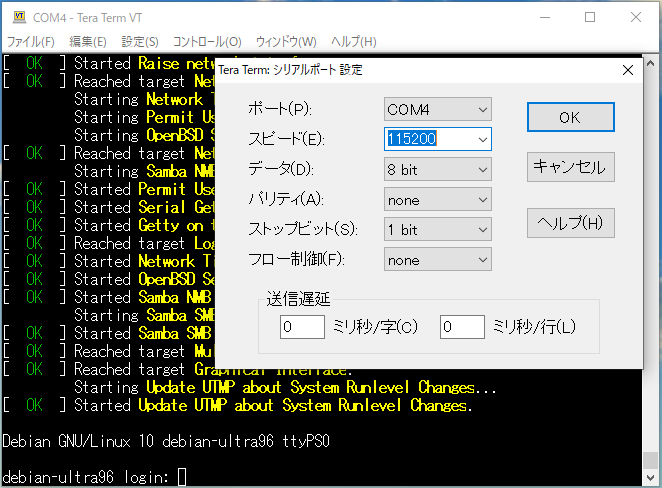
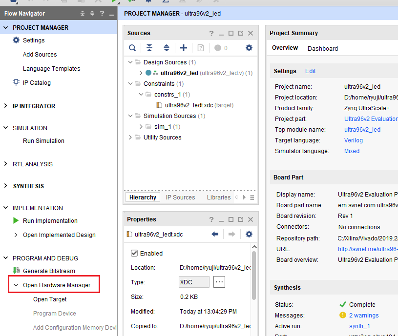
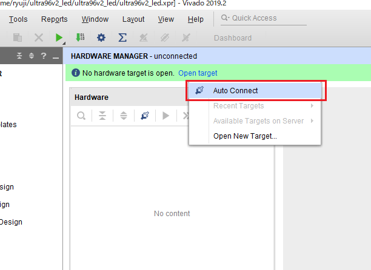
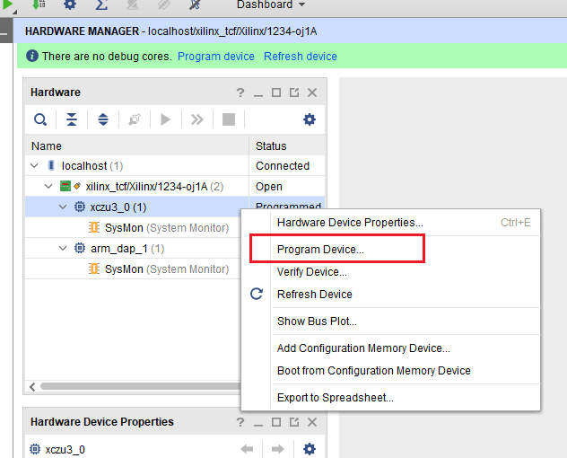
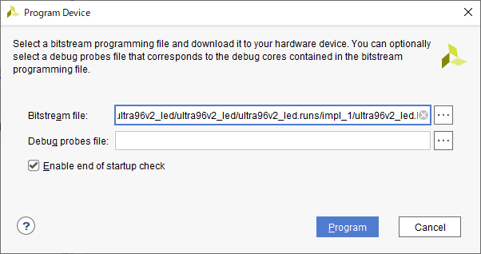
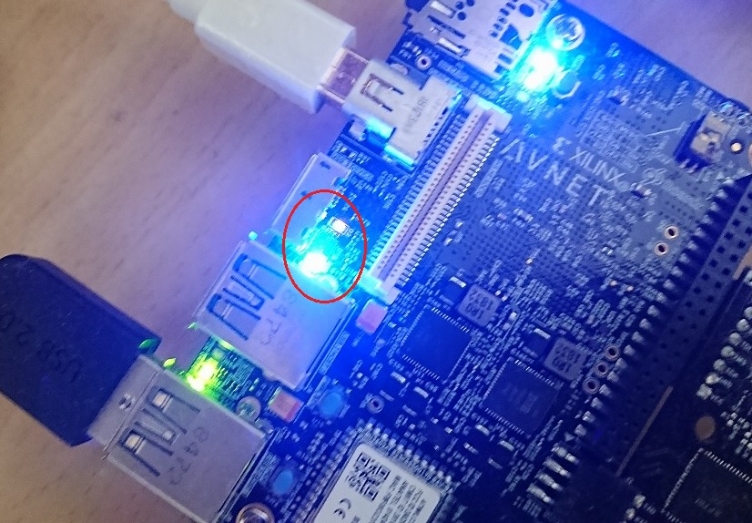

# はじめに
[Ultra96V2](https://www.avnet.com/wps/portal/japan/products/product-highlights/ultra96/) で PL から LED を光らせるいわゆるLチカ記事ですが特徴は以下の2点です。

- [@ikwzm](https://qiita.com/ikwzm)氏の[debianイメージ](https://qiita.com/ikwzm/items/92221c5ea6abbd5e991c)を利用させていただく
- PSではなくPLに繋がっているRADIO_LEDでLチカを行う

# 前提
まず別記事の[Ultra96V2用にPLでLEDチカを行うbitstreamを作る](https://ryuz.qrunch.io/entries/pr9UyKzOjTgKbieb)にてLチカを行うbitstreamができるところまで準備ができていることが前提の記事となります。

# 環境
今回はこんな環境で行っています。

- Vivado 2019.2
- Windows10マシン
- VirtualBox + Ubuntu(18.04.4 LTS)

VirtualBox 等は SD カードにブートイメージを作るのに使っているだけですので、一度ブートイメージさえ作ってしまえば、後は Vivado さえ動けば Windows でも Linux でも問題ありません。

# 事前準備
## ブートイメージの作成
実はここが一番大変な気がしますが、本家に詳しい説明があるのでざっくり割愛します(汗)

 こちら [https://qiita.com/ikwzm/items/92221c5ea6abbd5e991c](https://qiita.com/ikwzm/items/92221c5ea6abbd5e991c)

の手順に従ってイメージを作成ください。
一度イメージを作成したのちに dd コマンドなどでイメージを保存しておけば、[Win32 Disk Imager](https://forest.watch.impress.co.jp/docs/review/1067836.html) などのソフトでWindowsだけで再構築することも可能になるようです。

Ultra96V2には優先のLANが付いていませんので

- イメージ作成時にSSID等を設定しておく
- 起動後にUARTもしくは、キーボード＆モニタを繋ぐなどしてSSIDを設定してWiFiで繋ぐ

などが主な接続方法になるかと思います。

環境構築は私のブログでも[Ultra96V2環境構築メモ](https://ryuz.qrunch.io/entries/IzxRVFueeWfembFc)にも少し記載しております。

# まずはJTAGからダウンロードしてみる
[AES-ACC-U96-JTAG](https://www.avnet.com/shop/japan/products/avnet-engineering-services/aes-acc-u96-jtag-3074457345636446168/)などのJTAG接続用のボードを持っていることが前提となりますが、
最も簡単かつPL単体でのデバッグも役立つ方法がこれです。
PLでRTLプログラミングを楽しみたい場合は持っておいて損はないボードとなります。

ikwzm氏のdebianのブートイメージは 2019.2版から、uEnv.txt bootargs に cpuidle.off=1 が追加されており、Linux動作中にJTAGから接続することができます。
また、どうやら起動時にデフォルトでPL部は起動されてFabric Clock もデフォルト値で供給されている模様ですので起動だけしてJTAGから使うことができそうです。

## SDカードを挿して起動する
AES-ACC-U96-JTAGと、起動イメージを書き込んだSDカードをUltra96V2に取り付けて、AES-ACC-U96-JTAGとPCの間を microUSBケーブルで繋いで起動します。
この時、Ultra96のUARTが AES-ACC-U96-JTAG 経由で COMポートとしてPCに認識されますので、TeraTermなどのソフトで 115200bps 8bit ノンパリティー の設定で繋いでおけばターミナルとして利用できます。
私の場合はCOM4になりました。COMポートの番号は環境によって変わります。



しばらく待つとLinuxが起動してログイン画面になります。

## Vivadoから接続する
[Ultra96V2用にPLでLEDチカを行うbitstreamを作る](https://ho9g75yotmbpkjfj.qrunch.io/entries/pr9UyKzOjTgKbieb)で作成したプロジェクトを開き、Flow Navigator から「Open Hardware」をクリックします。



HARDWARE MANAGET が起動しますので、「Open target」をクリックして「Auto Connect」を選びます。



PCにターゲットが１つしかなければ Auto Connect で問題なく繋がります(複数台繋いでいる時とか、ネットワークで遠隔のFPGAに繋ぐ場合とかは「Open New Target...」を使いましょう)。

しばらくするとJTAGが認識され、デバイスが表示されますので、次の図のように zcu3_0 を右クリックして「Program Device...」を選択しましょう。



ダウンロードする Bitstream file を聞いてきますが、先に作成した bitstream がデフォルトで入っているかと思いますのでそのまま 「Program」を押しましょう。



しばらくすると書き込みが完了してLEDが点滅を始めるはずです。

## 動作を確認する
USBコネクタ付近の黄色と青のLEDが周期的に点滅しているのが見えれば成功です。



# Linuxから bitstream をダウンロードする
では次に、Linux 上から書き込むことに挑戦してみます。

## いろいろな方法
Linuxからbitstreamを書き込む方法はTwitter上でいろいろな方から教えていただき

-  configfsを使う方法
   https://xilinx-wiki.atlassian.net/wiki/spaces/A/pages/18841645/Solution+Zynq+PL+Programming+With+FPGA+Manager
- dtbocfg.rb を使う方法 
   https://github.com/ikwzm/ZynqMP-FPGA-XRT-Example-1-Ultra96
- cat bitstream.bit > /dev/xdevcfg でやる方法(カーネルが4.19以降はだめっぽい)
- PYNQで書き込む方法

などなど、非常にいろいろありそうです。
dtbocfg.rb などが非常に便利そうではあるのですが、ここでは私が一番初めに試した方法として、

https://xilinx-wiki.atlassian.net/wiki/spaces/A/pages/18841847/Solution+ZynqMP+PL+Programming の fpgautil.c をビルドして使うというのを紹介しておこうと思います。

## 事前準備(ファイルのコピー)
fpgautil.c は上記のURLから取得してください。
次に何らかの方法で、作成した ultra96v2_led.bit と fpgautil.c を Ultra96V2 のSDカードに転送する必要があります。ssh が繋がっていれば scp でもよいですし、SDカードに事前に直接コピーしておく手もあるかもしれません。
Windows の場合、FAT領域しかアクセスできませんが  /etc/fstab の設定が適切になされていれば /mnt/boot/ の下にマウントされているかと思います。
また Windows の場合は samba を起動してしまうのもお勧めの方法です。

## 実行
あとはこれらのファイルを置いたディレクトリに移動して
```
gcc fpgautil.c -o fpgautil
sudo ./fpgautil -b ultra96v2_led.bit
```

とすれば、コンパイルした fpgautil を用いてPLにbitstreamを書き込むことができます。
(注：本来 bootgenを用いて bin ファイルにする必要があるようですが、bitファイルのままでも書けました。うまくいかない場合は変換をお試しください)。
なおこの時 Device Tree Overlay を行うことで、この場で fclk を変更することも可能なようです。
詳しくは [こちら](https://qiita.com/ikwzm/items/74f7c5b8474198c8af3e)などが参考になりました。

