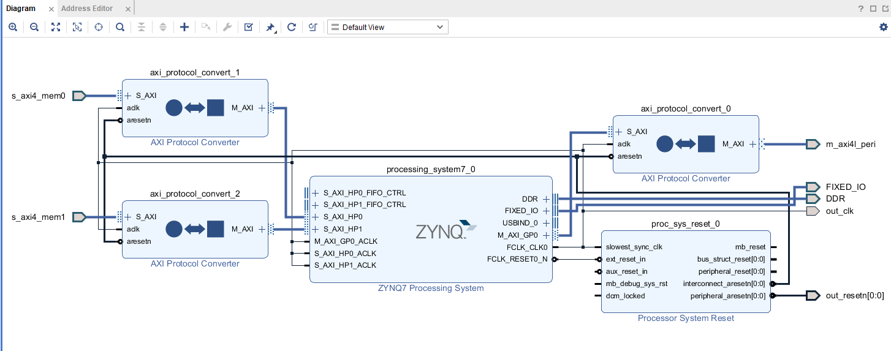

# はじめに

 iwkzm氏の[udmabuf](https://github.com/ikwzm/udmabuf)を試してみたので、自分用備忘録です。
なお、現在は udmabuf は u-dma-buf と名称変更中のようですが、少し古い情報で作ってしまったため、u-dma-buf の方を使う方は読み替えて頂ければと思います。

# 事前準備

## 環境
今回の環境は下記の通り。

- [ZYBO-Z7](https://reference.digilentinc.com/reference/programmable-logic/zybo-z7/start)
-  iwkzm氏の [Debianブートイメージ v1.0.1](https://qiita.com/ikwzm/items/7e90f0ca2165dbb9a577)
- Vivado 2019.2

Debianイメージは一度起動SDを作ってしまえば Vivado だけでもいろいろできるのが素敵です。
[こちら](https://ryuz.qrunch.io/entries/jU8BkKu8bxqOeGAC)の別記事でも少し紹介しておりますので参考になれば幸いです。

なおZYBO-Z7 には FPGA規模の違いで XC7Z010 のものと XC7Z020 のもとあります。今回は XC7Z020 を使っていますが、移植は容易と思います。


## ZYBO-Z7側の準備

bootgen を使うのでインストールしておきます。

```
git clone https://github.com/Xilinx/bootgen  
cd bootgen/  
make  
sudo cp bootgen /usr/local/bin/
```

他にも make や dtc など使うので、不足があれば随時 sudu apt install してください。


## ソースコードの所在
今回は拙作の [Jelly](https://github.com/ryuz/jelly) の１プロジェクトとして追加しています。

```
git clone https://github.com/ryuz/jelly
```
で取得でき、[/projects/zybo_z7_udmabuf_sample/](https://github.com/ryuz/jelly/tree/master/projects/zybo_z7_udmabuf_sample) 以下が今回のプロジェクトです。

# PL用bitstreamの作成
  PS用のbitstreamは PC(WindowsやLinuxなど)で Vivado を使って行います。

  Vivado のプロジェクトは
 /projects/zybo_z7_udmabuf_sample/syn/vivado2019.2
 のにあります。
Digilentのボードファイルなども入れておきましょう。

 zybo_z7_udmabuf_sample.xpr が vivado2019.2 のプロジェクトファイルで、 Block Design は 同じディレクトリにある design_1.tcl に export しております。
（design_1.tcl を実行すれば Block Design が作れるはずですが、一度今あるものをプロジェクトから消してから tcl 実行が必要かもしれません。）

合成すると、zybo_z7_udmabuf_sample.bit が出来上がります。
このファイルを projects/zybo_z7_udmabuf_sample/app にコピーしておいてください。

なお、回路の方は本記事の本質ではないので飛ばしますが、簡単にブロックデザインの部分のみ記載します。




PS部からはPLのDMAが DDR3-SDRAM にアクセスするために の 64bit幅 のAXI4のバススレーブと、0x43C0_0000 番地からアサインした、ペリフェラルアクセス用の32bit幅のAXI4Liteのバスマスターを protocol converter を挟んで出しております(ZYNQコアがAXI3バスなのでAXI4に変換しております)。

あとは [zybo_z7_udmabuf_sample.v](https://github.com/ryuz/jelly/blob/master/projects/zybo_z7_udmabuf_sample/rtl/zybo_z7_udmabuf_sample.v) の方で WISHBONE バスに変換した後に下記のようになるようにアドレスを割り当てています。

- テスト用簡易DMA0  0x43C0_0000 - 0x43C0_03FF
- テスト用簡易DMA1  0x43C0_0400 - 0x43C0_07FF
- LED制御レジスタ      0x43C0_4000 - 0x43C0_43FF

# ソフト側の作成と実行
  ZYBO-Z7側のソフトの開発です。
  projects/zybo_z7_udmabuf_sample/app を ZYBO-Z7 のどこか適当な箇所にコピーします。
  ZYBO-Z7側の作業は Debian のブートイメージで起動したあと、常に起動したまま行うことが可能で、運用したままPLとソフトをアップデートすることも可能なのがこのブートイメージの素晴らしいところです。

  ZYBO-Z7 の debian でも git は動きますので、こちらでも clone する手があります。
  (なお、この app ディレクトリ以下は VS code Remote Development を使ってセルフコンパイル開発してそのままZYBOからpushしています。)

## とりあえず動かしてみる

sudoできるユーザーで app ディレクトリに移動してください。
```
make run
```
とすればひとまず動くように作っております。
途中、sudo コマンドを使っているのでパスワードを聞かれると思いますが入力ください。

# Device Tree overlay
  ここから本記事のメインの部分です。
  今回は Device Tree overlay によって

- bitfile のダウンロード
- レジスタアクセスの為の uio の割り当て
- メモリ領域割り当ての為の udmabuf の割り当て

のなどの機能を担っています。

## dts ファイル
ここで [zybo_z7_udmabuf_sample.dts](https://github.com/ryuz/jelly/blob/master/projects/zybo_z7_udmabuf_sample/app/zybo_z7_udmabuf_sample.dts)ファイルの作成が重要となります。

順にみていきたいと思います。
なお、dtsファイルのコンパイルは、実行環境で行うことが必要なようです(内部で既存のDevice Treeのシンボルを参照する為)。

### bitstream 指定
``` 
    fragment@0 {  
        target = <&fpga_full>;
        __overlay__ {
            #address-cells = <1>;
            #size-cells = <1>;
  
            firmware-name = "zybo_z7_udmabuf_sample.bit.bin";
        };
    };
```
上のように指定します。この時、zybo_z7_udmabuf_sample.bit.bin は bitstream から bootgen で生成されたファイルであり、/lib/firmware に置かれている必要があります。

bootgen の使い方としては、下記のような zybo_z7_udmabuf_sample.bif に対して

```zybo_z7_udmabuf_sample.bif
all:
{
    zybo_z7_udmabuf_sample.bit
}
```

bootgenを用いて

```
bootgen -image zybo_z7_udmabuf_sample.bif -arch zynq -process_bitstream bin
```

と実行することによって得られます。

### uioとudmabuf
続いて uio と udmabuf です。
``` 
    fragment@1 {
        target-path = "/amba";
        __overlay__ {
            #address-cells = <0x1>;
            #size-cells = <0x1>;
            
            uio_pl_peri {
                compatible = "generic-uio";
                reg = <0x43c00000 0x00100000>;
            };

            udmabuf4 {
                compatible = "ikwzm,udmabuf-0.10.a";
                minor-number = <4>;
                size = <0x00400000>;
            };
        };
    };
``` 
今回はペリフェラル領域をまとめて一個の uio に割り当てています。
開始アドレス 0x43c00000番地から サイズ 0x00100000 バイトの領域が uio_pl_peri  という名前の uio として生成されます。

また udmabuf4 という名前で、0x00400000 バイトの CMA(Continuous Memory Allocator) を確保してもらうように指定しています。udmabuf を用いることで、連続した物理メモリアドレスを割り当ててもらうことが可能になります。

### dtcでのコンパイル
```
dtc -I dts -O dtb -o zybo_z7_udmabuf_sample.dtbo zybo_z7_udmabuf_sample.dts
```
とすることで zybo_z7_udmabuf_sample.dtbo を得ることができます。

## Overlay
いよいよ overlay です

### configfs の mount
初めに configfs をマウントします。
```
sudo mkdir -p /configfs
sudo mount -t configfs configfs /configfs
```
詳しくは[こちら](https://qiita.com/ikwzm/items/ec514e955c16076327ce)や[こちら](https://dora.bk.tsukuba.ac.jp/~takeuchi/?%E9%9B%BB%E6%B0%97%E5%9B%9E%E8%B7%AF%2Fzynq%2FDevice%20Tree%20Overlay)を参考にさせて頂いております。

### ファームウェアのコピー
必要なものを  /lib/firmware にコピーします。
```
sudo mkdir -p /lib/firmware
sudo cp zybo_z7_udmabuf_sample.bit.bin /lib/firmware
```

### overlay 
次に overlay を行います。

```
sudo mkdir -p /configfs/device-tree/overlays/full
sudo cp zybo_z7_udmabuf_sample.dtbo /configfs/device-tree/overlays/full/dtbo
sudo sh -c "echo 1 > /configfs/device-tree/overlays/full/status"
```

なおこの部分の手順は[Ultra96V2の記事](https://ryuz.qrunch.io/entries/TDI9ZcCSyZZSo332)と少し違う手順になっています。
この点について、[ikwzm氏から教えて頂いた情報](https://twitter.com/ikwzm/status/1256101833598046208)として、

> configFS を使った Device Tree Overlay のメカニズムは、Ultra96(ZynqMP) は Xilinx の linux-xlnx で提供されています。が、ZYBO(Zynq) で使っている Linux(メインライン)にはありません。仕方が無いので私が独自に作ったのですが、微妙に違ってしまったのです。。。（汗

とのことです。無ければ作ってしまうというところが凄いです。有難く使わせていただいております。

なお、この段階で bitstream は書き込まれ、PLは動作を開始しています。

動作開始後は役目を終えた /lib/firmware にコピーしたファイルは削除しても良いようです。

```
sudo rm /lib/firmware/zybo_z7_udmabuf_sample.bit.bin
```

## アプリケーションの実行
ここでアプロケーションを実行します。
/dev 以下に uio や dmabuf に対応するデバイスがが追加されているはずなのでそれらを開いてアクセスすることができます。

このやり方は[別の記事](https://ryuz.qrunch.io/entries/ijzqKpPDK4nWbGIU)で紹介しております。

詳しくは[main.cpp](https://github.com/ryuz/jelly/blob/master/projects/zybo_z7_udmabuf_sample/app/main.cpp)をお読みください。

うまく動けば、udmabuf領域にPLのコアからと、Cortex-A9 の双方からアクセスして、データがやり取りできることが確認できます。
また、uio にマップした RADIO_LED もソフトウェアから点滅させています。

## Device Tree Overlay の解除
すこし自信のないところなのですが
```
sudo sh -c "echo 0 > $(DEVTREE_PATH)/overlays/full/status"
sudo rmdir $(DEVTREE_PATH)/overlays/full
```
とすると解除できるようです。

