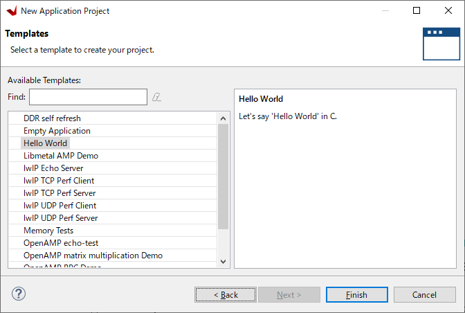
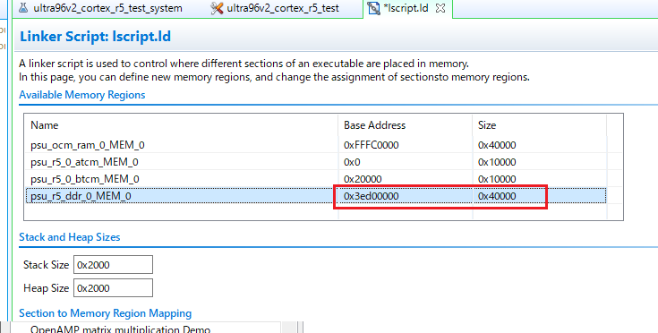
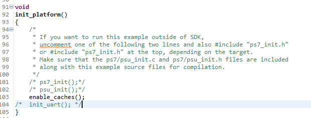

# 利用する環境
・Ultra96V2
・[ikwzm氏のDebianブートイメージ](https://qiita.com/ikwzm/items/92221c5ea6abbd5e991c)  (2019.2版)

# やってみること
Cortex-R5を使ってみる第一歩として、まずLinuxから認識させるために下記などの情報を見ながらDeviceTreeに内容を反映させてみようと思います。

- https://github.com/Xilinx/linux-xlnx/blob/master/Documentation/devicetree/bindings/remoteproc/xilinx%2Czynqmp-r5-remoteproc.txt
- https://japan.xilinx.com/support/documentation/user_guides/j_ug1085-zynq-ultrascale-trm.pdf


# DeviceTreeの編集
まずオリジナルの dts を取ってきてリネームして編集します。

```
cp devicetree-4.19.0-xlnx-v2019.2-zynqmp-fpga-ultra96v2.dts
mv devicetree-4.19.0-xlnx-v2019.2-zynqmp-fpga-ultra96v2.dts cortex-r5.dts 
```

cortex-r5.dts を適当なエディタで開いて interrupt-controller@f9010000 のセクションを探して "gic:" を追記します。

```
        gic: interrupt-controller@f9010000 {
```

次に  \_\_symbols\_\_  の定義の手前に下記を追加しました。

```
    reserved-memory {
        #address-cells = <2>;
        #size-cells = <2>;
        ranges;
        rproc_0_dma: rproc@0x3ed40000 {
            no-map;
            compatible = "shared-dma-pool";
            reg = <0x0 0x3ed40000 0x0 0x100000>;
        };
        rproc_0_reserved: rproc@0x3ed00000 {
            no-map;
            reg = <0x0 0x3ed00000 0x0 0x40000>;
        };
    };
    
    zynqmp-rpu {
        compatible = "xlnx,zynqmp-r5-remoteproc-1.0";
        #address-cells = <2>;
        #size-cells = <2>;
        ranges;
        core_conf = "split";
        r5_0: r5@0 {
            #address-cells = <2>;
            #size-cells = <2>;
            ranges;
            memory-region = <&rproc_0_reserved>, <&rproc_0_dma>;
            pnode-id = <0x7>;
            mboxes = <&ipi_mailbox_rpu0 0>, <&ipi_mailbox_rpu0 1>;
            mbox-names = "tx", "rx";
            tcm_0_a: tcm_0@0 {
                reg = <0x0 0xFFE00000 0x0 0x10000>;
                pnode-id = <0xf>;
            };
            tcm_0_b: tcm_0@1 {
                reg = <0x0 0xFFE20000 0x0 0x10000>;
                pnode-id = <0x10>;
            };
        };
    };
    
    zynqmp_ipi1 {
        compatible = "xlnx,zynqmp-ipi-mailbox";
        interrupt-parent = <&gic>;
        interrupts = <0 29 4>;
        xlnx,ipi-id = <7>;
        #address-cells = <1>;
        #size-cells = <1>;
        ranges;
        
        /* APU<->RPU0 IPI mailbox controller */
        ipi_mailbox_rpu0: mailbox@ff90000 {
            reg = <0xff990600 0x20>,
                  <0xff990620 0x20>,
                  <0xff9900c0 0x20>,
                  <0xff9900e0 0x20>;
            reg-names = "local_request_region",
                "local_response_region",
                "remote_request_region",
                "remote_response_region";
        #mbox-cells = <1>;
            xlnx,ipi-id = <1>;
        };
    };
```

引き続き

```
dtc -I dts -O dtb --symbols -o cortex-r5.dtb cortex-r5.dts
sudo cp cortex-r5.dtb /mnt/boot/
```

として、dtbにコンパイルして、/mnt/boot にコピーします。

引き続き /mnt/boot/uEnv.txt をroot権限で適当なエディタで開き、linux_fdt_image の部分を
```
#linux_fdt_image=devicetree-4.19.0-xlnx-v2019.2-zynqmp-fpga-ultra96v2.dtb
linux_fdt_image=cortex-r5.dtb
```
のように書き換えます。
このようにオリジナルを残しておけばいつでも元に戻せるのがこのブートイメージの素晴らしいところですね。

```
sudo shutdown -r now
```
としてリブートしましょう。

# 確認
起動後に dmesg コマンドで起動ログを確認すると
```
[   10.979450] zynqmp_r5_remoteproc zynqmp-rpu: RPU core_conf: split
[   10.986526]  r5@0: DMA mask not set
[   10.990081]  r5@0: assigned reserved memory node rproc@0x3ed40000
[   10.998586] remoteproc remoteproc0: r5@0 is available
```
となっている部分を見つけました。

```
% ls /sys/class/remoteproc/
remoteproc0
```

と、 remoteproc0 も出来ているようです。

# 動作確認
ここでは[先日の記事の「udmabuf を試してみる (Ultra96V2編)」](https://ryuz.qrunch.io/entries/TDI9ZcCSyZZSo332)を使ってLEDを点滅させて動作確認してみます。
vivado のプロジェクトから export hardware で ultra96v2_udmabuf_sample.xsa を出力し、その内容から Vitis で Application Project を作ります。

この時 psu_cortexr5_0 を選び


Hello World をひな型にします。


出来上がったプロジェクトのリンカスクリプト(lscript.ld)を編集しますが、これはGUIで行うことができ、psu_r5_ddr_0_MEM_0の領域を、先ほどデバイスツリーで rproc_0_reserved で確保した領域に変更します。


次に、UARTはAPU(Cortex-A53)のLinux管轄にあるので、RPUから触るはやめて、関連個所をコメントアウトします。
また、0xa0008000 番地にあるLEDの制御レジスタに書き込んで点滅するコードを書きます。



(いろいろ乱暴なコードですが、ひとまずの動作確認用という事でご容赦ください)

ソースコードが出来上がったら、Build すると elf ファイルが出来上がります。
出来上がった elf ファイルを Ultra96 にコピーして、PLに前回記事の回路をダウンロードした上で、以下のようなコマンドで動作させることができます。
```
sudo cp ultra96v2_cortex_r5_test.elf /lib/firmware
sudo sh -c "echo ultra96v2_cortex_r5_test.elf  > /sys/class/remoteproc/remoteproc0/firmware"
sudo sh -c "echo start > /sys/class/remoteproc/remoteproc0/state"
```
ここで無事LEDが点滅すれば成功です。

停止するには
```
sudo sh -c "echo stop > /sys/class/remoteproc/remoteproc0/state"
```
が必要で、一度停止させないと別のelfファイルを実行することはできないようです。
