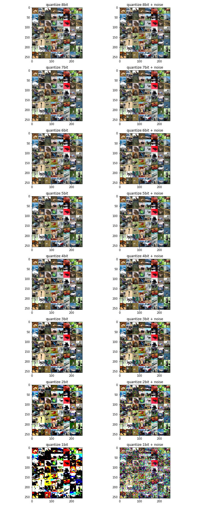
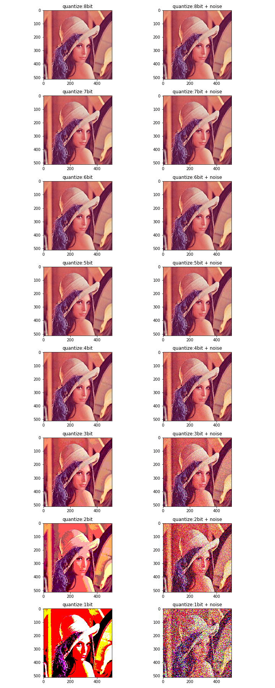

# 画像の量子化とディザに関する考察

[先日の記事](https://ryuz.qrunch.io/entries/LgqSqsEgOkzEnrZw)の最後で入力データの量子化をいくつかのパターンで実験しましたが、視覚的にどう見えるかを少し実験してみました。

というのは、実際問題1bitまで量子化しても結構認識できている点と、今後ディザ的な処理を追加したらどうなるかという点で興味があったからです。

単純に閾値をランダムにするだけでもディザとしての効果は得られます。これは先に画像の方にランダムノイズを載せてから量子化しても同じことですので、今回はそのような実験をしています。

## CIFAR-10 の場合

まずCIFAR-10について、最初の 64 個の画像を8bitのオリジナルから、1bitの量子化まで、1bitずつ削っていった場合と、それにノイズを載せたものを作ってみたのが下記です。

思いのほか 1bit でも人が見て判断できるものも残っています。
そしてこちらも思いのほか、乱数を乗せてディザ効果を期待したものは逆に人の目に分かり難くなっているように感じます。

## 一般画像(Lena)の場合

同じことを、一般画像についても行ってみました。

今回は、量子化を強めた画像は、人間から見ると乱数がある方が階調などの情報はより読み取れるようにも思えます。
基本的に画像データと言うのは隣接ピクセルとの相関が高く、低周波成分に情報が多く、また人間の目も高周波になるほど感度が下がります。目を細めてぼやけて(高周波感度をさらに下げて)みると、ディザ画像がよりきれいに見えることがあるのはそのためです。
結果としてノイズを乗せる(量子化閾値を変動させるのと等価)ことによって、量子化ノイズを高周波成分側に追いやることができるのがディザです。これはバイナリ変調におけるノイズシェーピングと考え方が近いものではないかと思います。

## 考察

解像度が高く、画像の特徴が低周波に多い場合、ディザは見た感じの主観ではある程度効果がありそうです。
AIも人間に近い特性を持っていますので、入力前の加工としては人の主観はある程度重要な尺度かと思います。
その際にCIFAR-10画像はうかつに解像度も低く、1ピクセルが独立で持つ情報が多いため、下手にノイズを乗せるとそれを壊しているように思います。
結果として、CIFAR-10画像などに関しては、量子化するのであれば、単純な変調ではなく、適応二値化などがまだ効果的なのではないかと思った次第です。

適応二値化のようなインテリジェントなことをする場合、それも機械学習で自動でやりたくなります。
幸い当サイトの取り組む LUT-Net は、こういった部分を低リソースで組むのに適したネットワークですので、初段の量子化を行う層自体を学習によって得るようなアプローチが試せるのではないかと考えている次第です。
