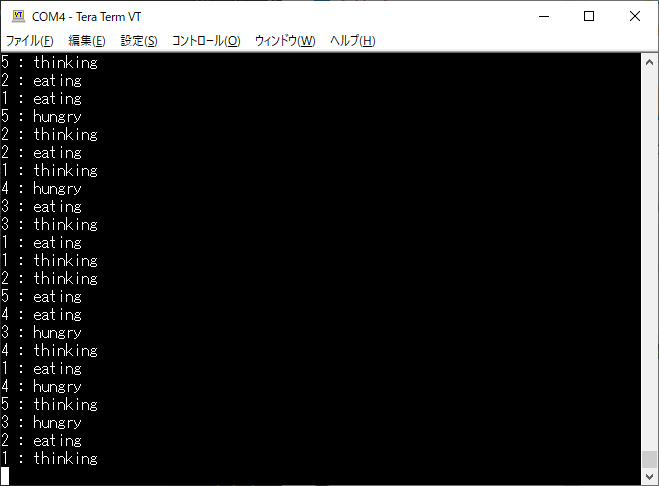
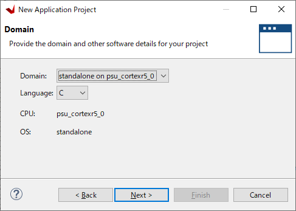
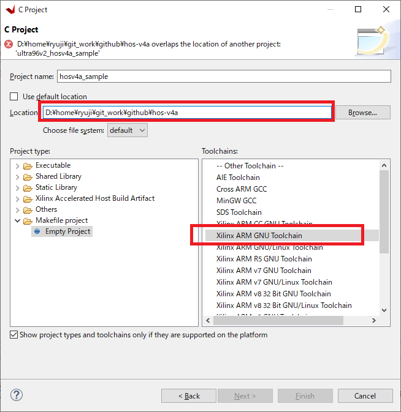
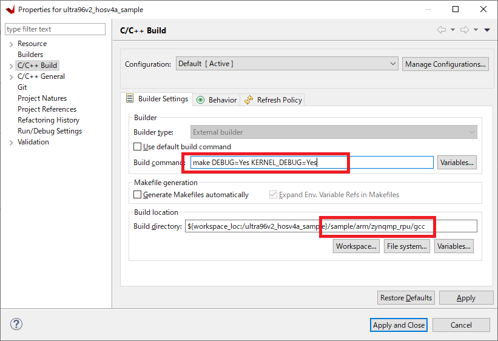
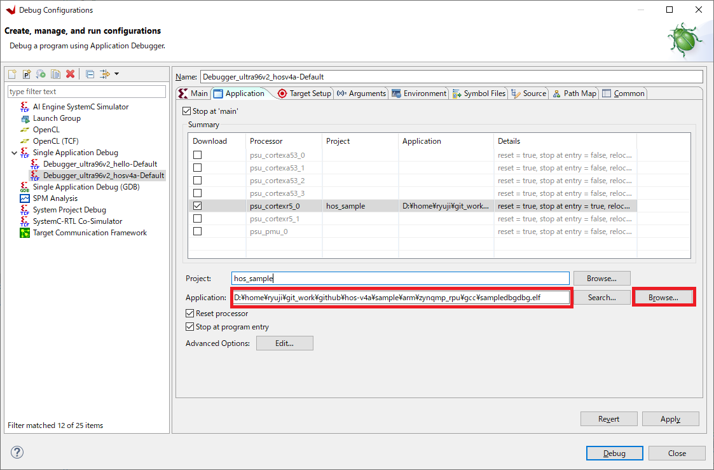

# はじめに

[HOS](https://ja.osdn.net/projects/hos/)は私がかなり昔に作って、長らくメンテすることもなく埋もれさせてしまっていた[ITRON4.0仕様](http://www.ertl.jp/ITRON/SPEC/mitron4-j.html)のRealTime OS ですが、Zynq のベアメタルプログラミングにのキャッチアップにちょうどいいのではないかと思い、今更ながら復刻させてみました。

今回、いきなり本家のリポジトリに手を入れるのもアレなので、いくつかある実装の中から HSO-V4Advance版を私の個人のgithubにcloneしてきて開発してます(安定したらまた考えます)。

[https://github.com/ryuz/hos-v4a](https://github.com/ryuz/hos-v4a)

Zynqといっても特に ZynqMP の場合、Linux はAPU(Cortex-A53)の方で動かしますので、Cortex-R5 が２個が自由に使える形で空いています。
PL部分のロジックを開発していると、少しだけ複雑なことを面倒見るシーケンサとしてプログラマブルなユニットが欲しくなることが良くあります。以前であれば MicroBlaze などをソフトコアCPU組み込んだりしていたところですが、ハードマクロの Cortex-R5 を使えばかなりパワフルでどこにでもアクセスできるコアが手に入ります(スピードグレード -1 でも 500MHzで動いて、VFPを搭載しているというのは魅力です)。
プロセッサを一個完全に占有したプログラミングと言うのは、他要素を一切気にする必要が無いので、意外にお手軽プログラミングで、かつ、リアルタイム保証も確実にできます。
流行りのDeepLearning なども、アクセラレートしたいまとまった演算部分をPLにやらせて、細かい後処理などで Cortex-R5 を活用するなどすると利用シーンが広がりそうです。

こんな Cortex-R5 のプログラミングが、Linux 上から、APUのプログラミングと同様に、build & run できると快適じゃないかなという事でやってみました。
なお、もちろん Vitis を使ったクロスコンパイルも、PCからJTAGを使ったデバッグも可能です。


# セルフコンパイル実行

## 事前準備

以前、[Ultra96V2のDebianイメージで Cortex-R5 を認識させる](https://ryuz.qrunch.io/entries/Eba3tiggSYkkOICC)を行った続きとしていますので、まずは ikwzm さんの Debian や、Cortex-R5 を認識させるための DeviceTree の修正などが必要です。

その上で、Debian Linux 上で

ツールインストール
```
sudo apt-get install gcc-arm-none-eabi
sudo apt-get install libnewlib-arm-none-eabi
```
とすれば、Cortex-R5 をビルドするためのgccのインストールが終わります。

## 論よりRUN
「とりあえず簡単に動くよ」アピールとして動かし方です。

まずUltra96V2 に ssh などで sudo 権限を持ったアカウントでログインします(UARTは出力に使うので使わないでください)。
また、このサンプルでは出力をUARTに出しているので、[JTAGボード](https://www.avnet.com/shop/japan/products/avnet-engineering-services/aes-acc-u96-jtag-3074457345636446168/)などが必要です。

ソース取得してビルド

```
git clone https://github.com/ryuz/hos-v4a.git
cd hos-v4a/sample/arm/zynqmp_rpu/gcc
make
```

そして実行 (Cortex-R5 からUART1 奪うので注意！)
Makefile の中で sudo 使ってますので必要に応じてパスワード打ち込んでください。

```
make run
```

別途UARTを TeraTerm などで開いておいて



のような感じで出力されれば成功です。

[食事する哲学者の問題](https://ja.wikipedia.org/wiki/%E9%A3%9F%E4%BA%8B%E3%81%99%E3%82%8B%E5%93%B2%E5%AD%A6%E8%80%85%E3%81%AE%E5%95%8F%E9%A1%8C)のサンプルなので、５つのタスクが、考えたり、食事したり、おなかすかせたりするのが、出力されます。

停止させるには

```
make stop
```

とすればOKです。

# クロスコンパイル

## Linux コマンドラインでビルド
簡単ですね。

```
source /tools/Xilinx/Vitis/2019.2/settings64.sh
git clone https://github.com/ryuz/hos-v4a.git
cd hos-v4a/sample/arm/zynqmp_rpu/gcc
make
```
ちなみに

```
make DEBUG=Yes
```
とするとデバッグ版をビルドします。(さらに KERNEL_DEBUG=Yes とするとカーネルの中もデバッグ版にします)。

もちろん VS code での開発も可能ですね。


## Windows コマンドラインでビルド

```
C:\Xilinx\Vitis\2019.2\settings64.bat
SET PATH=%PATH%;C:\Xilinx\Vitis\2019.2\tps\mingw\6.2.0\win64.o\nt\bin

git clone https://github.com/ryuz/hos-v4a.git
cd hos-v4a/sample/arm/zynqmp_rpu/gcc
make
```
ホストコンパイラとして g++ も使うので、C:\Xilinx\Vitis\2019.2\tps\mingw\6.2.0\win64.o\nt\bin にも追加でパスを通しています。


## Vitis (GUI)を使ってビルド(ベアメタルで起動してJTAGデバッグする)

最後に、Linux を起動せずにベアメタルで起動する方法も書いておきます。
ここではベアメタルで起動させてみます。
起動 Ultra96V2のDIP-SWを ON-ON にして JTAG モードで起動します。

まずはこの辺りの記事を参考にVivadoでPLを準備してxsaファイル作るところまで進めてください。

- [Ultra96V2のPLでLEDチカを行う(Vivadoでのbitstream作成編)](https://ryuz.qrunch.io/entries/pr9UyKzOjTgKbieb)
- [udmabuf を試してみる (Ultra96V2編)](https://ryuz.qrunch.io/entries/TDI9ZcCSyZZSo332)

Hello World などが JTAG から動くところまで準備します。
この時、プロジェクトを作るときに psu_cortexr5_0 を選んでおいてください。



また、sample を Vitis に追加するには、新規プロジェクトを 「C Project」として作成し、 Location に HOS を clone した場所を選び、「Makefile Project」を「Xilinx ARM GNU Toolchain」で生成します。



プロジェクトの Build command を必要に応じてオプション追加し、 Build directry に sample/arm/zynqmp_rpu/gcc を追加します。



最後にデバッグ時の Application に、直接ビルド済みの elf ファイルを指定してやれば、JTAG デバッグが可能になります。




# おわりに

もちろん、世の中的には Xilinxツールに標準で準備されている FreeRTOS + OpenAMP というのが真っ当なアプローチだと思いますし、ITRONが使いたいなら[Toppers/APS](https://www.toppers.jp/asp-kernel.html)というもっと洗練されたものがあります。

なのにわざわざこんなことするメリットとしては

- 中身を熟知してるので弄りやすく何でもできる(自分限定の理由)
- ikwzmさんのDebian上にOpenAMP移植するだけLinuxスキルが無い(笑)
- OS機能無関係にブートストラップと割り込み勉強するのにちょうどよかった
- OSが目的と言うより**「Linux 上から、build & run できる環境」を作るのに最適**だった
- 日本ではなんだかんだ言ってもまだITRONの情報は多い(日本語だし)

というあたりでしょうか。

ちなみに 今のサンプルでは、main関数でOSの起動を行っていますが、削除して自分の好きなプログラムを書くこともできます。
HOSは呼び出したサービスコールだけがリンクされる仕組みですので、何もサービスコールを呼ばないmain関数にすると、OSは何もリンクされることなく、単なるmake用のフレームワークとしてだけ使うことも可能です。
そういう使い方をしたいケースも多いと思いますので、その際にサンプルにでもなれば幸いです。

# さらに余談

今回の HOS-V4a の sample/arm/zynq7000 には ZYBO で動くサンプルもあり、Vitis からベアメタルとして同様に動かすことができます。
ただし、Zynq7000は Cortex-A9 のみなので、こちらは Linux と共存させるにはもう少し工夫が必要そうです。
