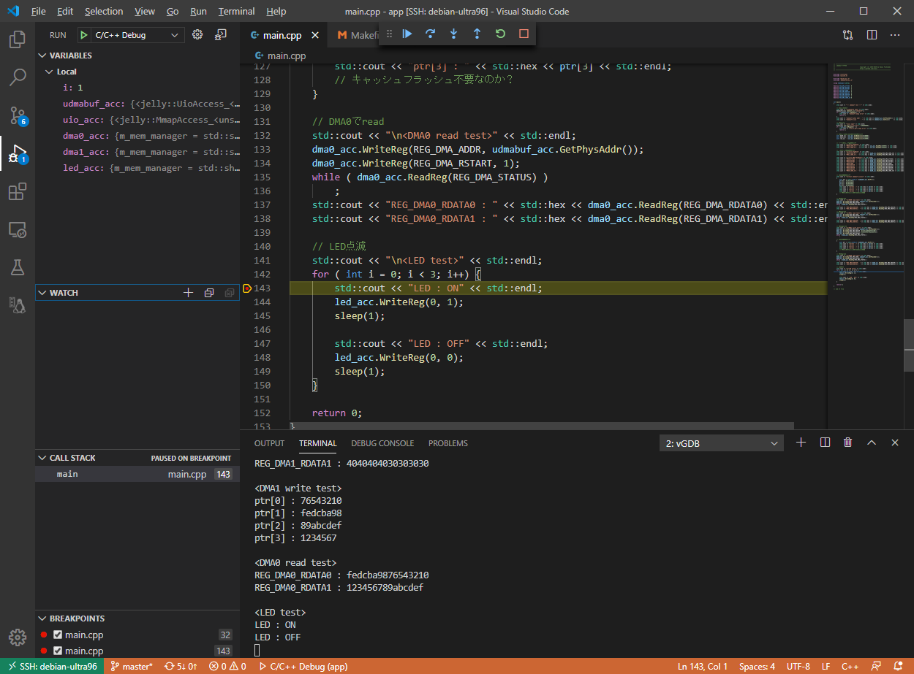

# はじめに

WindowsでもLinuxでも無償で利用でき、利用ユーザーも増えているマイクロソフトのエディタ [VS code](https://azure.microsoft.com/ja-jp/products/visual-studio-code/) ですが、Linux の動く Zynq や ZynqMP の開発に利用しても大変快適です。

私は

- [ZYBO](https://reference.digilentinc.com/reference/programmable-logic/zybo-z7/start) + [Debianブートイメージ](https://qiita.com/ikwzm/items/7e90f0ca2165dbb9a577)
- [Ultra96](https://www.avnet.com/wps/portal/japan/products/product-highlights/ultra96/) + [Debianブートイメージ](https://qiita.com/ikwzm/items/92221c5ea6abbd5e991c)

などで活用しています。

その際に利用するのが、[Remote Development using SSH](https://code.visualstudio.com/docs/remote/ssh) にある機能で、嬉しいことに AArch32 も AArch64 も対応があります。
正式には今のところ Raspbian と Ubuntu 向けのようですが、同系列の Debian でも特に困ることなく使えているようなので紹介してしまおうと思います。

なお、私は Debian イメージを活用させていただいていますが、Ubuntu などでも動くのではないかと思います。

なお、本ブログのほとんどは、既にうまく実施されている方の情報のかき集めなので、「Zynqでもできるよ」という紹介までなので、細かい部分で情報の欠落あるかと思いますが、ネタ元を調べながら挑戦頂ければ幸いに思います。


# VS code を接続するまで

## ssh公開鍵の準備

VS code を接続するには 、ssh 公開鍵の登録が必要なようです。私は[こちらのサイト](https://blog.masahiko.info/entry/2019/06/15/202003)を参考にさせて頂きました。

Windows の PowerShell なり Linux なりで

```
ssh-keygen -t rsa -b 4096
```

のようにすると ~/.ssh/id_rsa と ~/.ssh/id_rsa.pub が出来上がります。
Windowsの場合は C:\Users\(ユーザー名)\.ssh などにできます。私もWindowsですが便宜上UNIX風に ~/.ssh で以降も表記します。

(ちなみに私はローカル接続を前提に、横着してパスフレーズ無しにしています)。

この時できる公開鍵(id_rsa.pub)を、Zynq 側の Linux の ~/.ssh/authorized_keys に行追加(ない場合は新規作成)すれば準備OKです。
なお、 authorized_keys は自分以外の読み書きができないようにパーミッションを設定してください。

あと、  ~/.ssh/config に

```
Host *
    ForwardX11 yes
    ForwardX11Trusted yes

Host debian-ultra96
    HostName debian-ultra96
    User <username>

Host debian-zybo-z7
    HostName debian-zybo-z7
    User <username>
```

といった具合に config を書いておくと良いようです。
上記は私の環境で、debian-ultra96 や debian-zybo-z7 は、Ultra96 や Zybo の Debian に私が設定したホスト名です(/etc/hostname)
また username のところはそれぞれのログインユーザー名を入れてください。

余談ですが ForwardX11Trusted yes しておくと Windows10 の PowerShell からログインした場合にも ForwardX11 が使えるようです。

これで PowerShell  などから

```
ssh debian-ultra96
```

と打ち込むだけでログインできるようになったはずです。

さらに余談ですが、私は [TeraTerm](https://forest.watch.impress.co.jp/library/software/utf8teraterm/) をクラインととしてよく使うのですが

```
<hostname> /ssh2 /auth=publickey /user=<username> /keyfile="C:\Users\<username>\.ssh\id_rsa"
```

のようなコマンドライン引数を設定したショートカットを作ると一発で繋がって便利です（パスフレーズを使う場合は /ask4passwd オプションも組み合わせると良いらしい)。

## VS code からの接続

VS code を起動して F1 キーを押して、remote-ssh などと打ち込んでいくと候補が出てくるので

Remote-SSH: Connect to Host を選んでください。
~/.ssh/config で登録したホスト一覧が出てきますので繋ぎたいものを選択してください。

また、初回接続時にシステムを着かえるようなので Linux を選択してください。
接続した Zynq 側にもいろいろ初期設定をダウンロードするようで少し時間がかかりますが、繋がるとまるでローカルのPCのように扱えます。


## C++コードのデバッグとビルド

## C++コードのデバッグ

対象に GDB を入れておけば、gccなどでZynq上でセルフコンパイルしたC++コードのステップ実行によるデバッグも可能なようです。

なお gcc などでのビルド時に -g (デバッグ情報付与)とか -O0 (最適化抑止) を付けておく必要があります。

```
sudo apt install gd\b
```

として、gdb を入れた後で、VS code の方に vGDB というエクステンションを入れてみました。

F5キーを押すとデバッグに使うエクステンションが選べるので vGDB を選んで、launch.json を編集すればデバッグできます。

program のところに実行したいプログラムを登録するだけです。

```launch.json
{
    "version": "0.2.0",
    "configurations": [
        {
            "type": "vgdb",
            "request": "launch",
            "name": "C/C++ Debug",
            "program": "${workspaceFolder}/program.out",
            "args": [],
            "cwd": "${fileDirname}"
        }
    ]
}
```

こんな感じのデバッグイメージでブレーク張ったり、ステップ実行したり、変数のぞいたりできます。



## C++コードのビルド

私は主に Makeファイルを使っています。正直ターミナルからのビルドでもあまり困っていないのですが、当然ながら make コマンドをタスク登録しておくことはできるようです。この[辺りの記事](https://www.atmarkit.co.jp/ait/articles/1509/08/news019.html)が参考になりそうです。


# X-Window の接続

当方は C++ の開発時に OpenCV を使うことが多く、cv::imshow が VS code でも使えるととても便利です。
Windowsからだとそのままでは使えませんが、こちらの[サイトの方法](https://qiita.com/TumoiYorozu/items/5ff6e491d26d18dcd6fd)で無事に動きました。

```x11ssh.bat
@wsl export DISPLAY=localhost:0.0; ssh %*
```
という内容の bat ファイルを作っておいて、VS code の設定の Remote.SSH: Path で指定すればよいそうです。
