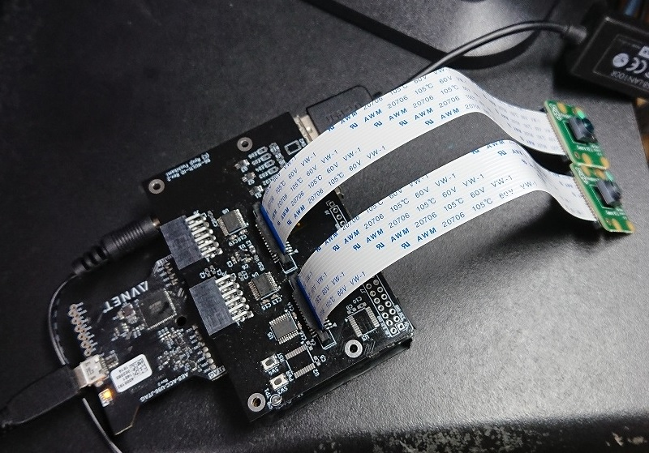
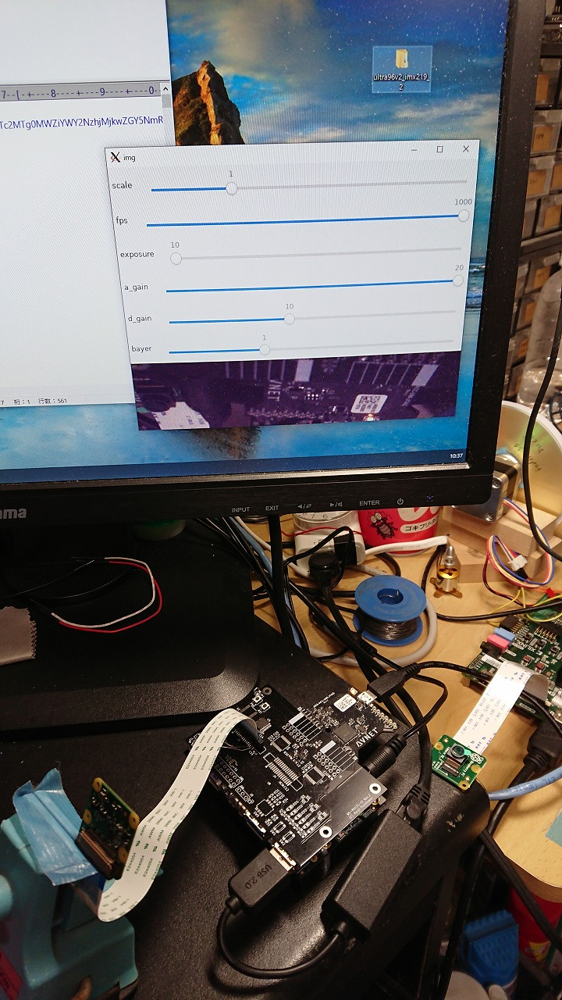
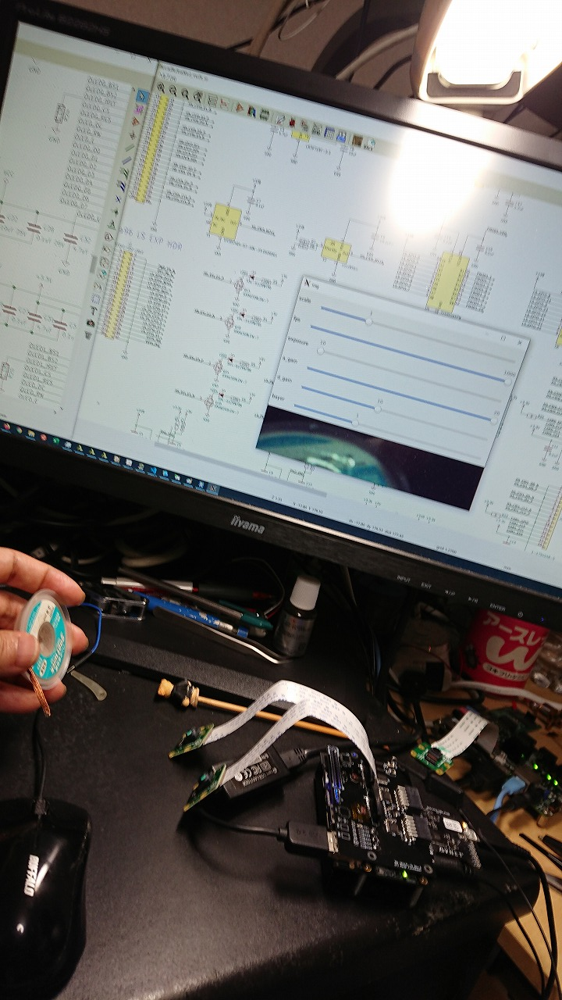
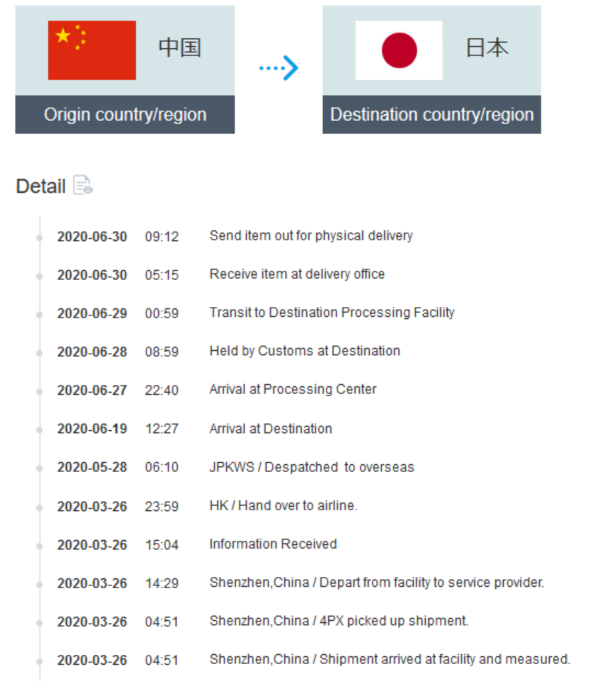
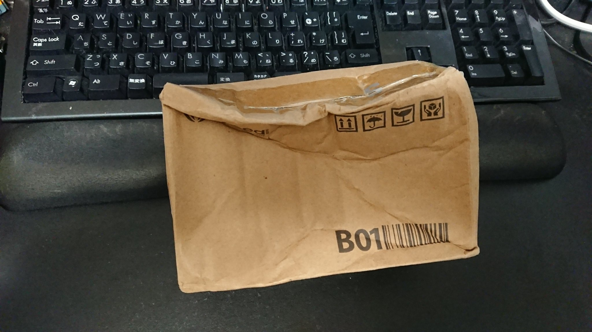
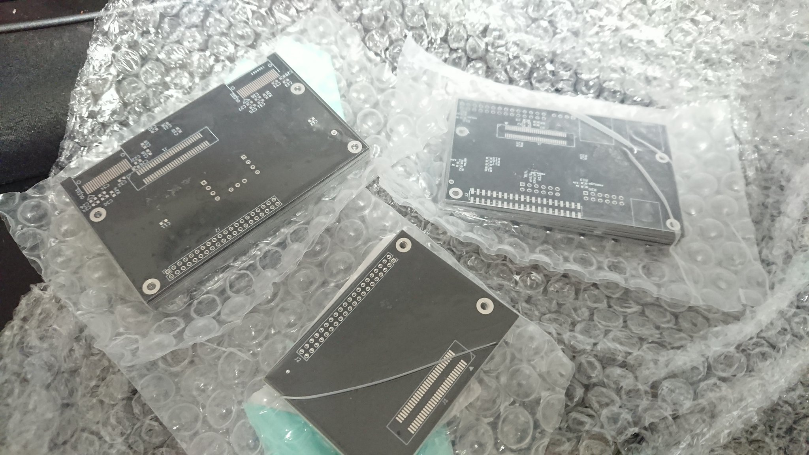

 [Ultra96V2](https://www.avnet.com/wps/portal/japan/products/product-highlights/ultra96/) 向けにI/Oをいろいろ拡張するボードを、[KiCAD](https://kicad-pcb.org/) にて設計し、[Fusion PCB](https://www.fusionpcb.jp/fusion_pcb.html)さんの 4.9ドルの基板製造サービスで作成してみました。

まだ現在進行形な部分はありますが、MIPI-CSI が動作確認できましたので、こちらで少し記事にしておきたいと思います。

Ultra96はとても魅力的なボードなのですが、PLにほとんど何も繋がっていない上に、拡張コネクタに出ている信号も電圧も 1.8V や 1.2V なので ZYBO のように使おうとすると、そのままではなかなか扱いずらく、いろいろ試しに載せてみました。

ちゃんとしたインピーダンスコントロールをしていませんので、運任せな部分もあるのですが、フリーのツールで2層基板の範疇でも結構いろいろできてしまうもので自分でも驚いております。

## ボードの写真

こんな感じに、Ultra96V2 と同じサイズで上にかぶさる形の基板をで、[Raspberry Pi Camera Module V2.1](https://jp.rs-online.com/web/p/video-modules/9132664/)が動作し始めました。

背景が散らかっている写真でお見苦しいですが、動作風景です。

## 設計データ

設計データは [github](https://github.com/ryuz/ultra96v2_multi_io/) に上げております。正直とても運よくたまたま作ったものが動いているだけなので、もし「クローンを作ってみよう」という方はくれぐれも自己責任でお願いします。

## コンセプト

設計コンセプトは

- [FusionPCB](https://www.fusionpcb.jp)さんの$4.9基板で作る
- [ZYBO](https://reference.digilentinc.com/reference/programmable-logic/zybo-z7/start) の良さ(PLのI/O機能の充実)の追加
- [Raspberry PI](https://ja.wikipedia.org/wiki/Raspberry_Pi) の良さ(PSのI/O機能の充実)の追加
- 使いたい機能だけ部品実装すれば最低限のコストで使える

です。

「動けばラッキー」でジャンクに手を出すのによく似た感覚でやっております。

## 機能

主な機能として

- PLの機能
    - TXS0108で3.3V双方向変換した12pin PMOD × 2個
    - RaspberryPI互換 MIPI-CSIコネクタ× 2個
    - LED × 4個
    - プッシュスイッチ × 2個 
    - ディップスイッチ(4bit) × 1個 
    - クロック供給 (クロックあればPS起こさなくても、JTAGモード起動でも遊べるぞ！)
- PSの機能
    - LED × 2個
    - TXS0108で3.3V双方向変換したGPIO
    - TXS0108で3.3V双方向変換したI2C
    - TXS0108で3.3V双方向変換したSPI
- その他の機能
    - 隠れると困るPWR/RSTスイッチの引き出し
    - 申し訳程度にUSB2.0信号を引き出したピンヘッダ

ですが、まだ全部の機能は私も試していません。

## インピーダンスコントロールについて

特に MIPI-CSI は、[こちら](http://nahitafu.cocolog-nifty.com/nahitafu/2008/11/post-57a1.html)を参考にさせて頂いて、基板厚 0.6mm の想定で設計時の机上計算のみ行っています)。

そうなのです。ちゃんとやるととても高いので、かなり運任せで冒険しています。
リピート製造しても次も動くかどうかはわかりません。

ちなみに2層基板なので、マイクロストリップラインと言いつつGND層までが遠いので、配線幅がとても太くなります(MIPIのフレキケーブルの配線幅が太いのがとても納得できました)。

## FPGAのプロジェクト

FPGAのプロジェクト自体は[以前の記事](https://ryuz.qrunch.io/entries/HHNg4YlfKOugd19G)で書いた ZYBO 用のものをほぼそのまま移植して実験中です。
まだ整備中ですが[こちら](https://github.com/ryuz/jelly/tree/develop/projects/ultra96v2_imx219)にあります。

# 余談

## コロナ禍での配送

今回、送料もケチって一番安いシンガポールポストさん(普通でも一か月弱かかる事がある)を選択ていた上に、Fusion PCB さんから発送頂いた直後にコロナ騒動が始まってしまい、出荷頂いたボードが海を渡るのにものすごい時間がかかる事態となりました。
無事に到着しましたが、その時の旅の記録が下記です。

長旅の過酷さを物語る到着時の荷姿。

でも他の基板と合わせてしっかりパッキングしていただき、中身は無傷で到着でした(素晴らしい)。

## Fusion PCBさんの4.9ドル基板の最初の昔の思い出

BGAなFPGAを自宅でホットプレートリフローしたときの[動画](https://www.youtube.com/watch?v=57MtmjFNmus)と[ブログ記事](http://ryuz.txt-nifty.com/blog/2012/09/bga-jtag-aa93.html)です。

